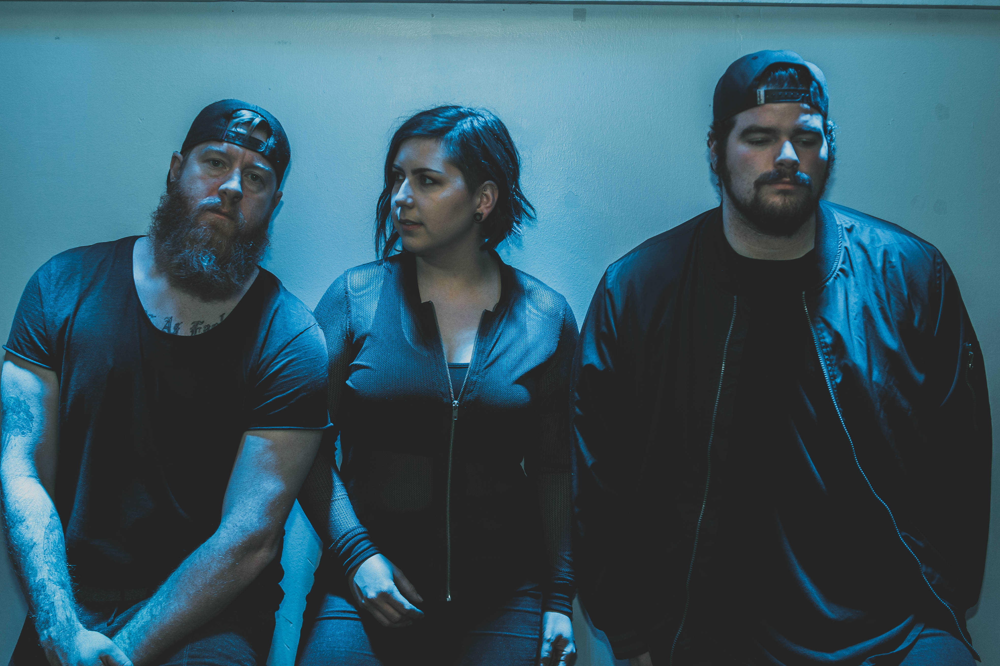

**FAYETTEVILLE, 25 February 2020 –** For some, music is the only foundation on which to build their lives and the only way to make sense of the world around them. For NW Arkansas hard rock band, Theody, this couldn’t be more true. With lives tied together by music, memories and matrimony, these vets of the scene are back with their latest single, “The In Between.”

After years of writing, recording and touring their story, Theody shares an intimate look at what it really means to live as an artist and a believer in the power of creative expression. “'The In Between' is some of my most vulnerable lyric art yet,” said vocalist and songwriter, Lauren Kinder. “The words poured out of my soul when I found myself in a sea of mixed emotions and anxiety.”

Since their start in 2013, Theody has told an intricate story of hope through honest music and authentic relationships. So far, the band has released two studio albums, an EP and several singles. “The In Between” is the trio’s sixth single release, paving the way for another full-length album later this year.

> “If this song was born only to help me process my emotions, then it was worth it,” said Kinder. “But I hope that it might resonate with whoever listens to it on a personal level as well.”

Learn more at [theodymusic.com](http://theodymusic.com).

https://www.youtube.com/watch?v=PeO0pZWybW0

https://open.spotify.com/album/3XWXcgxtadlagcISavyX4N

 

**About Theody**

Hailing from NW Arkansas, Theody started as a solo project for vocalist and songwriter, Lauren Kinder. Teaming up with her husband Charles and several friends, Kinder began performing live and picking up traction in the local and regional rock scene. As more opportunities arose, their growing fan base made it obvious that this was more than just a solo project. Chad Wunderle joined the group in 2016 contributing his unmistakable and passionate drumming style that has anchored Theody as they’ve developed their sound. Six years, two full-length albums, an EP and six singles later, Theody is as eager as ever to give their all; on and off the stage. Throughout multiple nation-wide tours, Theody has crafted an impressive live show and continues to crank out lyrics and melodies so catchy, you’ll be singing along in no time. This is not just another chart chaser; Theody brings energy with convicting voice to every project and concert.

Follow  them on [Facebook](https://www.facebook.com/Theodyband/) and on [Instagram](https://www.instagram.com/theodyband/).
